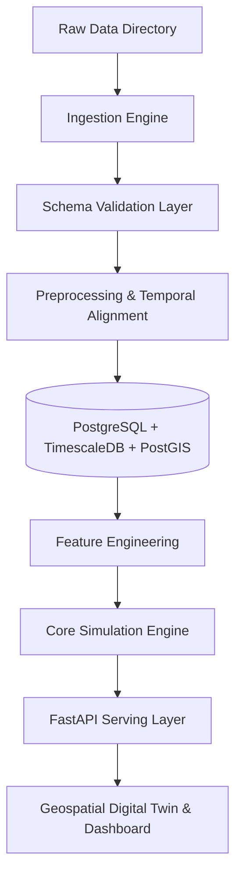

# System Architecture: Energy Supply Chain Resilience Platform

This document outlines the high-level software and data architecture for the Energy Supply Chain Resilience platform. The design is structured to prioritize data integrity, transparency, and provenance.

## Architectural Layers

### 1. Data Ingestion Layer (`src/ingestion/`)
- Programmatically reads raw files from `data/raw/` (Excel worksheets, CSVs).
- Validates file integrity using SHA256 hashes against `data_manifest.json`.
- Outputs structured data into temporary staging areas.

### 2. Schema Validation Layer (`src/validation/`)
- Ensures data adheres to strict schema definitions (data types, column counts, non-null requirements).
- Flags anomalies like unexpected negative values, malformed dates, or invalid categories.
- Outputs machine-readable quality reports to `data/quality/`.

### 3. Preprocessing & Alignment Layer (`src/preprocessing/`)
- Standardizes date formats across datasets (handles mixed date formats like DD-MM-YYYY, YYYY-MM-DD, text month names like "April 2025", and Financial Year notation like "1997-98").
- Filters out spacer lines, summary headings, and double-counted totals from spreadsheet layouts.
- Performs temporal alignment: interpolates or aggregates data (e.g., matching daily Brent prices and daily GPR indices with monthly consumption and refinery processing throughputs).

### 4. Database & Storage Layer (Docker Infrastructure)
- **PostgreSQL / PostGIS**: Stores geospatial infrastructure data (refinery coordinates, ports, pipeline paths, maritime shipping lanes).
- **TimescaleDB**: Stores time-series data (crude prices, geopolitical indices, monthly consumption, imports, exports).
- **Redis**: Caches heavy geospatial routes, scenario run states, and dashboard endpoints for quick display.

### 5. Feature Engineering Layer (`src/features/`)
- Merges temporal datasets (e.g., lagged Brent price, geopolitical shock indices, previous month refinery utilization).
- Builds regional geopolitical tension indices by querying specific columns (e.g., `GPRC_IND` for India, `GPRC_CHN` for China) in the monthly Caldara-Iacoviello index.

### 6. Core Simulation & Optimization Engine
- **Scenario Simulator (`src/scenarios/`)**: Executes mathematical models to compute downstream capacity drops and price shocks if maritime choke points (Strait of Hormuz, Bab-el-Mandeb) are blocked.
- **Strategic Reserve & Routing Optimization (`src/optimization/`)**: Solves routing and inventory models to recommend alternative import sources and ISPRL drawdowns.

### 7. API Layer (`src/api/`)
- A REST API (built using FastAPI) that serves model predictions, scenario simulation results, geospatial digital twin coordinates, and provenance tracking metadata.
