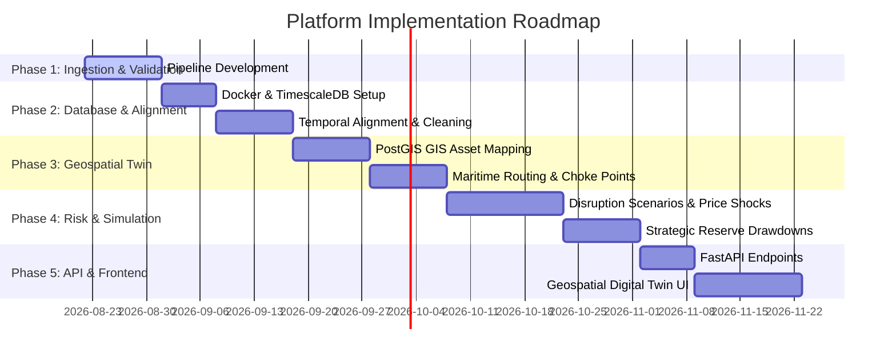

# Technical Implementation Plan: Energy Supply Chain Resilience Platform

This document describes the recommended future technical phases to construct the Energy Supply Chain Resilience platform for India.

## Phase Overview

---

## Phase 1: Ingestion & Schema Validation
- **Goal**: Establish a robust Python ingest pipeline.
- **Tasks**:
  1. Write structured pandas-based parsers to extract raw datasets from Excel sheets and CSVs.
  2. Implement an automated validation system that compares input shapes, columns, and data types against the schema contracts defined in `docs/data-contracts.md`.
  3. Log schema errors and output machine-readable validation summary logs under `data/quality/`.

## Phase 2: Database Integration & Preprocessing
- **Goal**: Implement the local database stack and temporal alignment logic.
- **Tasks**:
  1. Create a `docker-compose.yml` to spawn PostgreSQL (with PostGIS and TimescaleDB extensions) and Redis services.
  2. Write preprocessing modules (`src/preprocessing/`) to:
     - Standardize dates into UTC timestamps.
     - Strip spacer and summary rows.
     - Standardize text month names to YYYY-MM-DD formats.
     - Harmonize daily/monthly frequencies (e.g. forward-filling Brent prices to match daily GPR).
  3. Load processed records into TimescaleDB tables.

## Phase 3: Geospatial Twin & Routing Engine
- **Goal**: Model the physical routing infrastructure.
- **Tasks**:
  1. Define geospatial points for Indian refineries, crude receiving ports (e.g., Vadinar, Mundra, Paradip), and international supply centers.
  2. Map major maritime choke points (Strait of Hormuz, Bab-el-Mandeb, Malacca Strait) and shipping lanes.
  3. Build a routing engine (using pgRouting or NetworkX) to calculate geodesic distances and transit times from global crude ports to India.

## Phase 4: Disruption Simulation & Optimization
- **Goal**: Construct risk models and strategic reserve action simulators.
- **Tasks**:
  1. Build a scenario engine (`src/scenarios/`) to simulate choke point blockages.
  2. Implement predictive formulas to estimate refinery throughput reductions and downstream domestic oil product price shifts under supply contractions.
  3. Code an optimization solver (`src/optimization/`) using linear programming to suggest alternative sourcing allocations and ISPRL drawdown patterns.

## Phase 5: API Serving & Digital Twin Dashboard
- **Goal**: Serve simulation analytics to the geospatial interface.
- **Tasks**:
  1. Build FastAPI REST routes to run scenarios, fetch provenance manifest metadata, and fetch geospatial network coordinates.
  2. Construct the MaplibreGL / Leaflet dashboard to render the energy supply chain digital twin.
