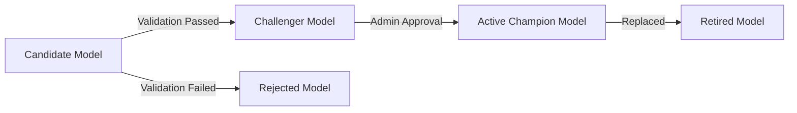

# MLOps Model Lifecycle Governance

> **Platform**: Energy Resilience Intel  
> **Module**: Model Registry (`src/models/model_registry.py`, `src/api/services/model_promotion.py`)

---

## 1. Overview

In enterprise deployment, ML models cannot be updated arbitrarily. Energy Resilience Intel enforces strict Champion/Challenger model lifecycle governance.

---

## 2. Model States & Transition Pipeline



- **Candidate**: Newly trained model artifact awaiting automated validation checks.
- **Challenger**: Validated model passing out-of-sample performance gates (ROC-AUC $\ge 0.75$).
- **Champion**: Currently active production model used by FastAPI inference endpoints.
- **Retired**: Superseded model preserved for rollback audit trails.
- **Rejected**: Model failing data schema, performance, or calibration thresholds.

---

## 3. Metadata Manifest & Lineage

Every registered model artifact tracks full reproducibility metadata:

```json
{
  "model_key": "v1.1",
  "corridor_id": "HORMUZ",
  "status": "CHAMPION",
  "dataset_sha256": "e3b0c44298fc1c149afbf4c8996fb92427ae41e4649b934ca495991b7852b855",
  "feature_schema_hash": "a591a6d40bf420404a011733cfb7b190d62c65bf0bcda32b57b277d9ad9f146e",
  "git_commit_sha": "cb8759a",
  "created_at": "2026-08-23T04:50:00Z",
  "metrics": {
    "roc_auc": 0.824,
    "brier_score": 0.041,
    "recall": 0.875
  }
}
```

---

## 4. RBAC Permission Gates

- **Candidate Submission**: Requires `MODEL_VALIDATE` scope (`ML_ENGINEER` or `ADMIN`).
- **Champion Promotion**: Requires `MODEL_PROMOTE` scope (`ADMIN` only).
- **Rollback Execution**: Requires `MODEL_ROLLBACK` scope (`ADMIN` only).
